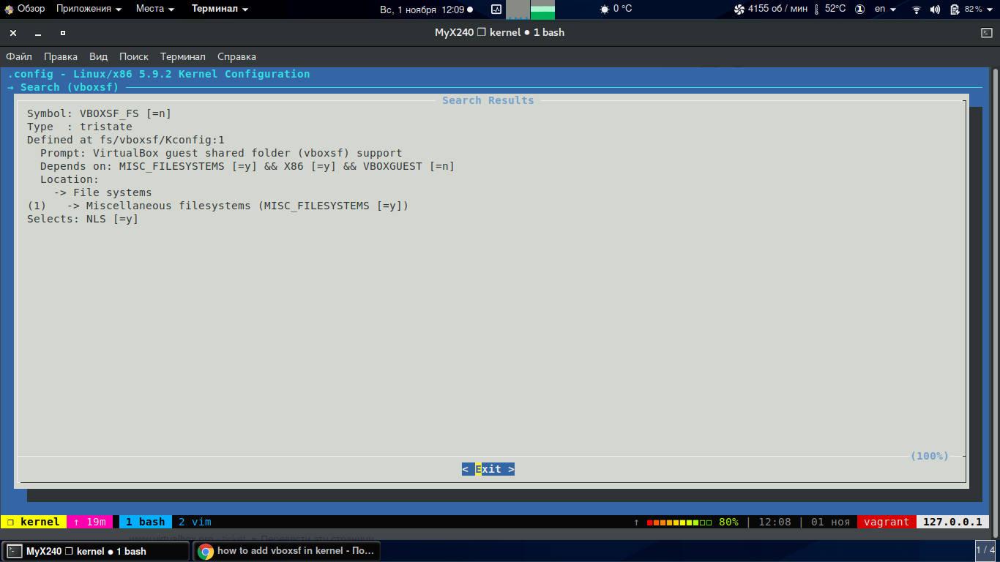
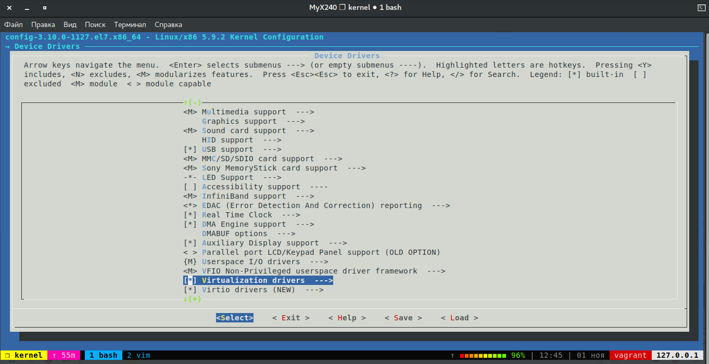
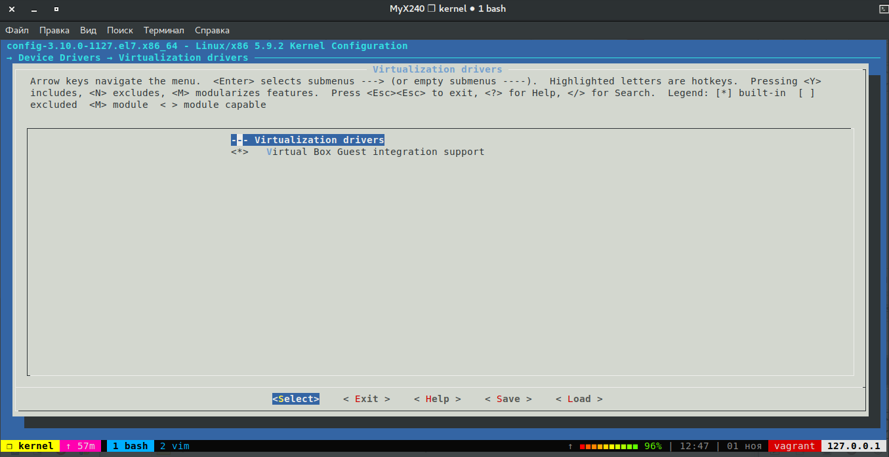
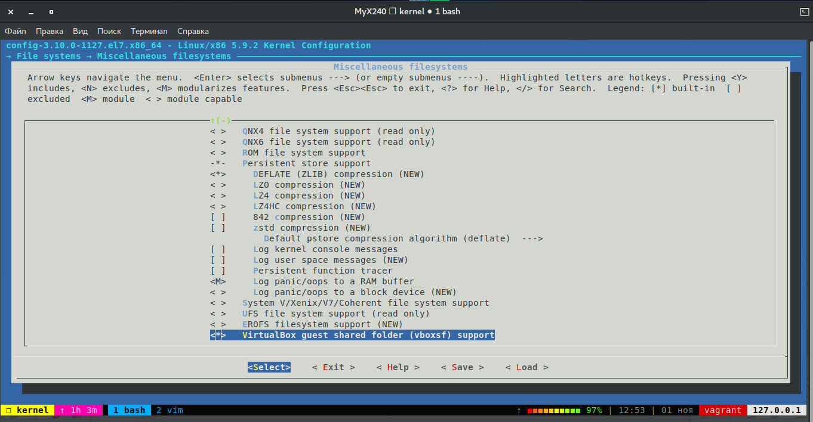
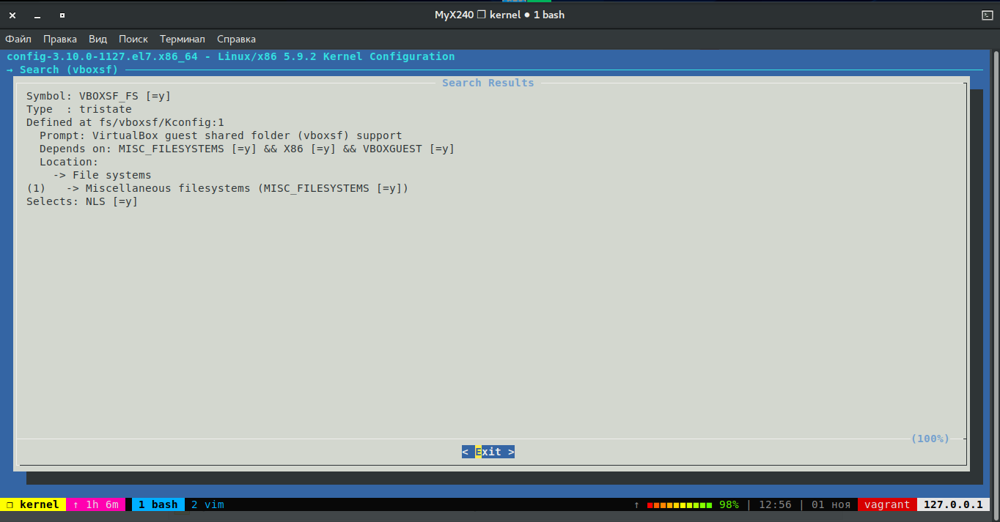
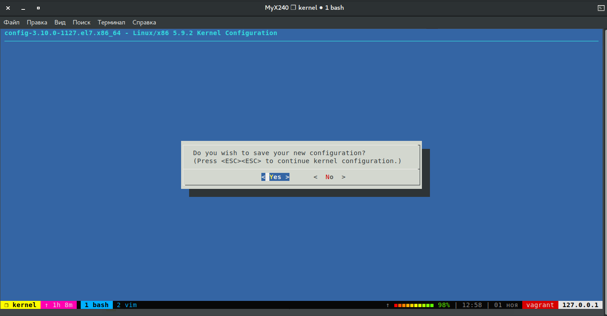

# **Домашнее задание "Сборка ядра из исходников"**
## **Задача:**
## Получить опыт сборки ядра из исходного кода.  
## Собрать ядро с поддержкой модуля: vboxsf_fs.
###  **Подготовка**
Клонируем репозиторий на локальную машину  
` git clone https://github.com/dmitry-lyutenko/manual_kernel_update.git`
Переходим в папку репозитория и отключаем его:
```bash
git remote -v
origin  https://github.com/dmitry-lyutenko/manual_kernel_update.git (fetch)
origin  https://github.com/dmitry-lyutenko/manual_kernel_update.git (push)
[dkasyan@MyX240 manual_kernel_update]$ git remotе rm origin
```
Просматриваем и запускаем ВМ:
```bash
 ls -1
 manual
 packer
 Vagrantfile
 [dkasyan@MyX240 manual_kernel_update]$ vagrant up
 [dkasyan@MyX240 manual_kernel_update]$ vagrant ssh
```
Проверяем версию ОС и ядра на ВМ:
```bash
[vagrant@kernel-update ~]$ cat /etc/os-release
NAME="CentOS Linux"
VERSION="7 (Core)"
ID="centos"
ID_LIKE="rhel fedora"
VERSION_ID="7"
PRETTY_NAME="CentOS Linux 7 (Core)"
ANSI_COLOR="0;31"
CPE_NAME="cpe:/o:centos:centos:7"
HOME_URL="https://www.centos.org/"
BUG_REPORT_URL="https://bugs.centos.org/"

CENTOS_MANTISBT_PROJECT="CentOS-7"
CENTOS_MANTISBT_PROJECT_VERSION="7"
REDHAT_SUPPORT_PRODUCT="centos"
REDHAT_SUPPORT_PRODUCT_VERSION="7"

[vagrant@kernel-update ~]$ uname -a
Linux kernel-update 3.10.0-1127.el7.x86_64 #1 SMP Tue Mar 31 23:36:51 UTC 2020 x86_64 x86_64 x86_64 GNU/Linux
[vagrant@kernel-update ~]$ uname -r
3.10.0-1127.el7.x86_64
```
На стенде имеем машину ОС CentOS 7 с ядром 3.10.0  
Установим крайнюю стабильную версию ядра Linux 5.9.2 с `https://www.kernel.org/`  

### **Получение крайней версии ядра**

Скачаем и распакуем крайнюю версию ядра с https://kernel.org
```bash
[vagrant@kernel-update ~]$ wget https://cdn.kernel.org/pub/linux/kernel/v5.x/linux-5.9.2.tar.xz
[vagrant@kernel-update ~]$ tar -xf linux-5.9.2.tar.xz
[vagrant@kernel-update ~]$ ls
linux-5.9.2  linux-5.9.2.tar.xz
[vagrant@kernel-update ~]$ cd linux-5.9.2/
```
### **Сборка ядра**
Обновим пакеты:
```bash
[vagrant@kernel-update linux-5.9.2]$ sudo yum update -y
```
Просмотрим файлы текущего ядра   
```bash
[root@kernel-update linux-5.9.2]# ls -la /boot
total 22724
dr-xr-xr-x.  4 root root      275 Apr 30  2020 .
dr-xr-xr-x. 17 root root      240 Apr 30  2020 ..
-rw-r--r--.  1 root root   153562 Mar 31  2020 config-3.10.0-1127.el7.x86_64
drwxr-xr-x.  3 root root       17 Apr 30  2020 efi
drwx------.  5 root root       97 Apr 30  2020 grub2
-rw-------.  1 root root 12405333 Apr 30  2020 initramfs-3.10.0-1127.el7.x86_64.img
-rw-r--r--.  1 root root   320512 Mar 31  2020 symvers-3.10.0-1127.el7.x86_64.gz
-rw-------.  1 root root  3611662 Mar 31  2020 System.map-3.10.0-1127.el7.x86_64
-rwxr-xr-x.  1 root root  6762688 Mar 31  2020 vmlinuz-3.10.0-1127.el7.x86_64
```
Для сборки ядра, создать конфигурационный файл можно несколькими способами:
- генерация конфига с нуля `make config`
- загрузка и адаптация конфига текущего ядра `make oldconfig`
- генерация конфига с применением псевдографического интерфейса `make menuconfig`  

Посчтаем количество строк конфигурации текущего ядра:
```bash
[vagrant@kernel-update linux-5.9.2]$ wc -l /boot/config-3.10.0-1127.el7.x86_64
6527 /boot/config-3.10.0-1127.el7.x86_64
```
Для упрощения создания конфигурационного файла, скопируем конфигурацию текущего ядра и добавим модули `vboxsf_fs`.
```bash
[vagrant@kernel-update linux-5.9.2]$ cp /boot/config-3.10.0-1127.el7.x86_64 ./.config
[vagrant@kernel-update linux-5.9.2]$ ls
arch   config-3.10.0-1127.el7.x86_64  crypto         fs       ipc      kernel    MAINTAINERS  net      scripts   tools
block  COPYING                        Documentation  include  Kbuild   lib       Makefile     README   security  usr
certs  CREDITS                        drivers        init     Kconfig  LICENSES  mm           samples  sound     virt
```
---
При сборке ядра добавим поддержку модуля `vboxsf_fs`  
Добавм эти модули при сборке ядра.  

скриншоты:  
  
  
  
  
  
  

Сохраним конфигурацию в файл `.config`  

Пробуем собрать ядро:
```bash
[vagrant@kernel-update linux-5.9.2]$ make menuconfig
  HOSTCC  scripts/basic/fixdep
  /bin/sh: gcc: command not found
  make[2]: *** [scripts/basic/fixdep] Error 127
  make[1]: *** [scripts_basic] Error 2
  make: *** [__sub-make] Error 2
```
В системе отсутствуют пакеты для сборки ядра.  
Установим необходимые пакеты:
```bash
[vagrant@kernel-update linux-5.9.2]$ sudo yum install -y ncurses-devel make gcc bc bison flex elfutils-libelf-devel openssl-devel grub2
```
Запустим сборку ядра. Получаем ошибку с низкой версией gcc.  
```bash
./include/linux/compiler-gcc.h:15:3: error: #error Sorry, your compiler is too old - please upgrade it.
```
Соберём gcc из исходников, воспользуемся ссылкой: `https://linuxhostsupport.com/blog/how-to-install-gcc-on-centos-7/`  
Выполним команды:
```bash
wget http://ftp.mirrorservice.org/sites/sourceware.org/pub/gcc/releases/gcc-7.3.0/gcc-7.3.0.tar.gz
ls
tar zxf gcc-7.3.0.tar.gz
ls
cd gcc-7.3.0/
ls
sudo yum install bzip2
./contrib/download_prerequisites
./configure --disable-multilib --enable-languages=c,c++
make -j4
sudo make install
gcc --version
```
Пороверим версию gcc:
```bash
[vagrant@kernel-update gcc-7.3.0]$ gcc --version
gcc (GCC) 7.3.0
Copyright (C) 2017 Free Software Foundation, Inc.
This is free software; see the source for copying conditions.  There is NO
warranty; not even for MERCHANTABILITY or FITNESS FOR A PARTICULAR PURPOSE.
```
Запустим сборку ядра командами:
```bash
make -j4 bzImage
make -j4 modules
make
make install
make modules_install
```
```bash
[vagrant@kernel-update linux-5.9.2]$ make -j4 bzImage
DESCEND  objtool
CALL    scripts/atomic/check-atomics.sh
CALL    scripts/checksyscalls.sh
CHK     include/generated/compile.h
CC      fs/seq_file.o
CC      drivers/pci/setup-irq.o
CC      net/core/sock.o i
...

[vagrant@kernel-update linux-5.9.2]$ make -j4 modules
[vagrant@kernel-update linux-5.9.2]$ make modules -j4
DESCEND  objtool
CALL    scripts/atomic/check-atomics.sh
CALL    scripts/checksyscalls.sh
CHK     include/generated/compile.h
[vagrant@kernel-update linux-5.9.2]$ ls
COPYING        LICENSES        System.map                     crypto   ipc              modules.builtin.modinfo  security  vmlinux
CREDITS        MAINTAINERS     arch                           drivers  kernel           modules.order            sound     vmlinux.o
Documentation  Makefile        block                          fs       lib              net                      tools     vmlinux.symvers
Kbuild         Module.symvers  certs                          include  mm               samples                  usr
Kconfig        README          config-3.10.0-1127.el7.x86_64  init     modules.builtin  scripts                  virt
```
Выполним команды:
```bash
sudo ls /boot
sudo chmod +x /boot/vmlinuz-5.9.2
sudo ls -la /boot
```
Результат выполнения:
```bash
[vagrant@kernel-update linux-5.9.2]$ ls /boot
System.map                              efi                                        vmlinuz
System.map-3.10.0-1127.19.1.el7.x86_64  grub2                                      vmlinuz-3.10.0-1127.19.1.el7.x86_64
System.map-3.10.0-1127.el7.x86_64       initramfs-3.10.0-1127.19.1.el7.x86_64.img  vmlinuz-3.10.0-1127.el7.x86_64
System.map-5.9.2                        initramfs-3.10.0-1127.el7.x86_64.img       vmlinuz-5.9.2
System.map-5.9.2.old                    initramfs-5.9.2.img                        vmlinuz-5.9.2.old
config-3.10.0-1127.19.1.el7.x86_64      symvers-3.10.0-1127.19.1.el7.x86_64.gz
config-3.10.0-1127.el7.x86_64           symvers-3.10.0-1127.el7.x86_64.gz
[vagrant@kernel-update linux-5.9.2]$
```
### **Обновление ядра**
Обновим загрузчик `grub2`, проверим версию ядра и перезагрузимся с обновленным ядром:  
Изменим  GRUB_DEFAULT=0
```bash
[vagrant@kernel-update ~]$ sudo cat /etc/default/grub
GRUB_TIMEOUT=1
GRUB_DISTRIBUTOR="$(sed 's, release .*$,,g' /etc/system-release)"
GRUB_DEFAULT=0
GRUB_DISABLE_SUBMENU=true
GRUB_TERMINAL_OUTPUT="console"
GRUB_CMDLINE_LINUX="no_timer_check console=tty0 console=ttyS0,115200n8 net.ifnames=0 biosdevname=0 elevator=noop crashkernel=auto"
GRUB_DISABLE_RECOVERY="true"
...
[vagrant@kernel-update ~]$ sudo grub2-mkconfig -o /boot/grub2/grub.cfg
Generating grub configuration file ...
Found linux image: /boot/vmlinuz-5.9.2
Found initrd image: /boot/initramfs-5.9.2.img
Found linux image: /boot/vmlinuz-5.9.2.old
Found initrd image: /boot/initramfs-5.9.2.img
Found linux image: /boot/vmlinuz-3.10.0-1127.19.1.el7.x86_64
Found initrd image: /boot/initramfs-3.10.0-1127.19.1.el7.x86_64.img
Found linux image: /boot/vmlinuz-3.10.0-1127.el7.x86_64
Found initrd image: /boot/initramfs-3.10.0-1127.el7.x86_64.img
done
[vagrant@kernel-update linux-5.9.2]$ uname -r
3.10.0-1127.19.1.el7.x86_64
[vagrant@kernel-update linux-5.9.2]$
[vagrant@kernel-update linux-5.9.2]$ sudo reboot
[dkasyan@MyX240 manual_kernel_update]$ vagrant ssh
[vagrant@kernel-update ~]$ uname -r
5.9.2
```
Ядро обновленно до версии 5.9.2.

### **Заключение**  


---
Сборка ядра из исходников, не простая и долгая задача. По моему мнению к ней стоит прибегать только в исключительных случаях.

