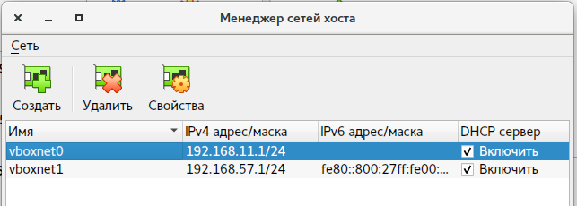
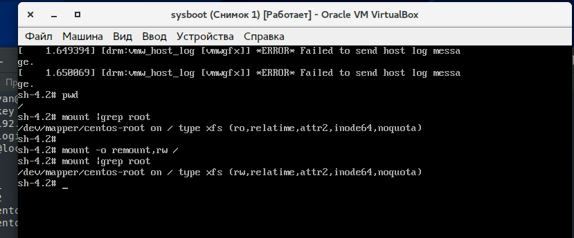
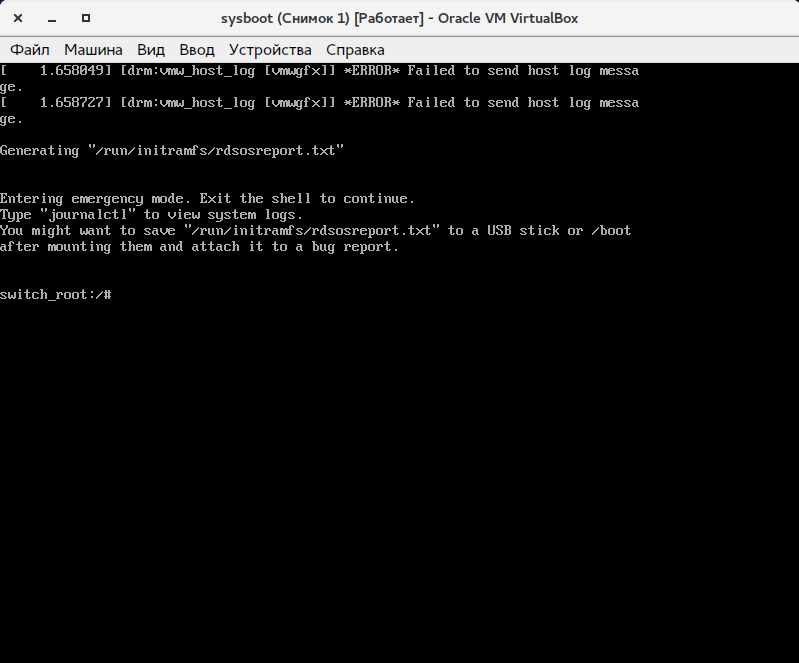
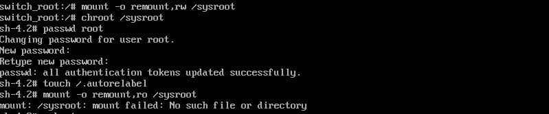
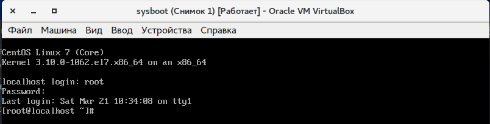
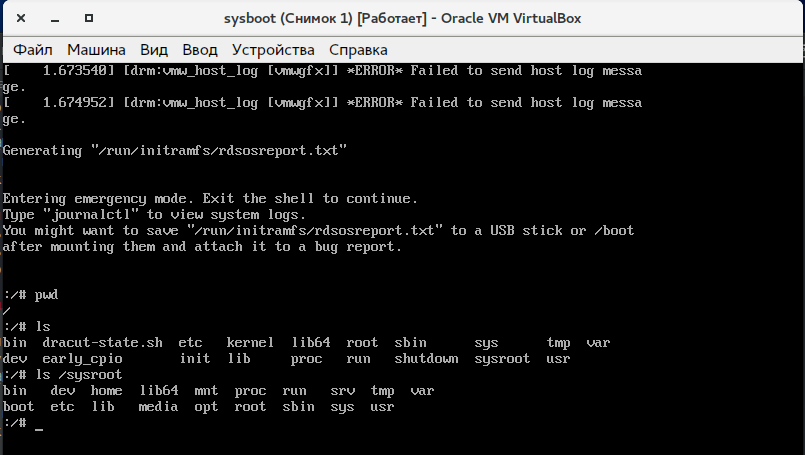
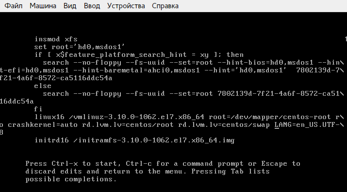
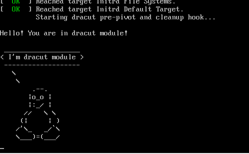

# lab7_system-boot
## Подготовка стенда
### Загрузка ситемы
Развертывание ВМ из Vagrantfile, потерпела неудачу

Загрузим минимальный образ с зеркала CentOS
Настроим виртуальную машину вручную.
1. Включим EFI режма в VirtualBox
1. Настрим из графический режим VirtualBox
1. Включим дополнительный сетевой интерфейс vboxnet1

2. Настроим доступ по ssh

После развертывания ВМ определяем диски и точки монтирования:
```Bash
[user@localhost ~]$ lsblk
NAME            MAJ:MIN RM  SIZE RO TYPE MOUNTPOINT
sda               8:0    0    8G  0 disk
├─sda1            8:1    0    1G  0 part /boot
└─sda2            8:2    0    7G  0 part
  ├─centos-root 253:0    0  6,2G  0 lvm  /
  └─centos-swap 253:1    0  820M  0 lvm  [SWAP]
sr0              11:0    1 1024M  0 rom
[user@localhost ~]$
```
## Попасть в систему без пароля несколькими способами
### Способ 1 **init=/bin/sh**
Задание выполнено по методичке:



Загрузка с обновленным паролем **не удалась**. Так как действия по изменению пароля описаные в методичке проводились во временной файловой системе.

### Способ 2 **rd.break**
Скриншоты выполнения ниже:


этап 1 Получение доступа к временной ФС.


этап 2 Измеение пароля **root**, перезагрузка системы.


загрузка с обновленым паролем

### Способ 3. **rw init=/sysroot/bin/sh**
Загрузка без запроса пароля удалась. Система загружена в безопасном режиме. Скриншот ниже. Для изменения пароля необходимо повторить действия из второго пунктка второго шага.


## Установить систему с LVM, после чего переименовать VG
Домашнее задание выполнялось на стенде lab4_lvm. Во время выполнения ДЗ трудностей не возикло. Отчеты выполнения ниже.

После загрузки снимаем начальную конфигурацию разделов.

```Bash
[vagrant@lvm ~]$ lsblk
NAME                    MAJ:MIN RM  SIZE RO TYPE MOUNTPOINT
sda                       8:0    0   40G  0 disk
├─sda1                    8:1    0    1M  0 part
├─sda2                    8:2    0    1G  0 part /boot
└─sda3                    8:3    0   39G  0 part
  ├─VolGroup00-LogVol00 253:0    0 37.5G  0 lvm  /
  └─VolGroup00-LogVol01 253:1    0  1.5G  0 lvm  [SWAP]
sdb                       8:16   0   10G  0 disk
sdc                       8:32   0    2G  0 disk
sdd                       8:48   0    1G  0 disk
sde                       8:64   0    1G  0 disk
[vagrant@lvm ~]$
[vagrant@lvm ~]$ sudo su -l
[root@lvm ~]# vgs
  VG         #PV #LV #SN Attr   VSize   VFree
  VolGroup00   1   2   0 wz--n- <38.97g    0
[root@lvm ~]#
```
Переимыновываем VolumeGroup
```bash
Volume group "VolGroup00" successfully renamed to "OtusRoot"
[root@lvm ~]#
```
Вносим мзменения в конфигурационные файлы. Заменяем `VolGroup00` на `OtusRoot` в файлах /etc/fstab, /etc/default/grub, /boot/grub2/grub.cfg. Перезагружаемся. Проверяем конфигурацию разделов.
```Bash
[vagrant@lvm ~]$ lsblk
NAME                  MAJ:MIN RM  SIZE RO TYPE MOUNTPOINT
sda                     8:0    0   40G  0 disk
├─sda1                  8:1    0    1M  0 part
├─sda2                  8:2    0    1G  0 part /boot
└─sda3                  8:3    0   39G  0 part
  ├─OtusRoot-LogVol00 253:0    0 37.5G  0 lvm  /
  └─OtusRoot-LogVol01 253:1    0  1.5G  0 lvm
sdb                     8:16   0   10G  0 disk
sdc                     8:32   0    2G  0 disk
sdd                     8:48   0    1G  0 disk
sde                     8:64   0    1G  0 disk
[vagrant@lvm ~]$ sudo vgs
  VG       #PV #LV #SN Attr   VSize   VFree
  OtusRoot   1   2   0 wz--n- <38.97g    0
[vagrant@lvm ~]$
```
## Добавить модуль в  initrd
Для проведения этой части работы испоользуем ранее развернутую вручную ВМ. Скопируем фалы из методички на целевую ВМ.
```bash
[dkasyan@MyX240 materials]$ scp gistfile1.sh test.sh user@192.168.57.3:/home/user/
Load key "/home/dkasyan/.ssh/id_rsa": Is a directory
user@192.168.57.3's password':
gistfile1.sh                            100%  126   200.2KB/s   00:00
test.sh                                 100%  334   614.0KB/s   00:00
[dkasyan@MyX240 materials]$
[user@localhost ~]$
[root@localhost ~]# cd /usr/lib/dracut/modules.d/01test
[root@localhost 01test]# ll
total 8
-rwxr-xr-x. 1 root root 126 Mar 21 14:27 gistfile1.sh
-rwxr-xr-x. 1 root root 334 Mar 21 14:27 test.sh
[root@localhost 01test]#

[user@localhost ~]$ ll
итого 8
-rwxrwxr-x. 1 user user 126 мар 21 13:53 gistfile1.sh
-rwxrwxr-x. 1 user user 334 мар 21 13:53 test.sh
[user@localhost ~]$
```
Переименуем скрипт `gistfile1.sh` в `module-setup.sh`:
```bash
Последний вход в систему:Вт мар 24 15:12:31 EDT 2020на pts/0
[root@localhost ~]# ll /usr/lib/dracut/modules.d/01test/
total 8
-rwxr-xr-x. 1 root root 126 Mar 21 14:27 module-setup.sh
-rwxr-xr-x. 1 root root 335 Mar 24 15:13 test.sh
[root@localhost ~]#
```
Пересобирем образ **initrd** командой `dracut -f -v`
Перезагрузимся.
Отключим параметы `rghb и quet` при загрузке:



При загрузке мы видим текстовое лого пингвина:


