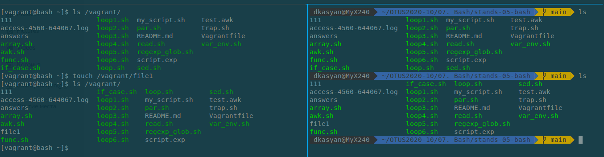

# Домашнее задание по теме: Bash, awk, sed

## Подготовка стенда

Для выполнения задания подготовим стенд и настроим `SharedFolders` в Vagrant.  
По умолчанию используемый образ Centos/7  использует синхронизацию rsync при старте ВМ.  
В данной работе нам необходимо обмениваться файлами с хостовой машиной. Реализация обмена файлами в Vagrant может осуществляться несколькими путями.

- настройкой `sshfs`
- настройкой `NFS`
- настройкой `SharedFolders`

Остановимся на последнем варианте. Данный вариант универсаелен для разных образов ВМ. Имеет как приемущества и недостатки.  
Основной недостаток - долгий старт ВМ при ее создании. Т.к.  при старте собирается модуль ядра с поддержкой ...  

<details>
<summary> Установим плагин vagrant-vbguest </summary>

```bash
 dkasyan@MyX240  ~/OTUS2020-10/07. Bash/stands-05-bash   main  vagrant plugin install vagrant-vbguest
 Installing the 'vagrant-vbguest' plugin. This can take a few minutes...
 Fetching micromachine-3.0.0.gem
 Fetching vagrant-vbguest-0.28.0.gem
 Installed the plugin 'vagrant-vbguest (0.28.0)'!

 dkasyan@MyX240  ~/OTUS2020-10/07. Bash/stands-05-bash   main  vagrant plugin list
 vagrant-scp (0.5.7, global)
 vagrant-vbguest (0.28.0, global)
```

</details>  

Внесем изменения в `Vagrantfile`  
Добавим разрешение на обновление ядра для Centos из документации к `vagrant-vbguest` : https://github.com/dotless-de/vagrant-vbguest  
Синхронизируем текущую директорию с директорией `/vagrant` на ВМ  

```bash
35 ###
36           box.vbguest.installer_options = { allow_kernel_upgrade: true }
37 ###
38           config.vm.synced_folder ".", "/vagrant", type: "virtualbox"
```

Запустим ВМ. В конфигурации прописаны три ВМ с именами:

- bash
- mysql
- nginx

Создание ВМ происходило продолжительное время, по причине сборки и включения модуля ядра ...  
В результате все три ВМ имеют поддержку плагина:

```bash
 dkasyan@MyX240  ~/OTUS2020-10/07. Bash/stands-05-bash   main  vagrant vbguest --status
 [bash] GuestAdditions 6.1.16 running --- OK.
 [mysql] GuestAdditions 6.1.16 running --- OK.
 [nginx] GuestAdditions 6.1.16 running --- OK.
```

Подключимся к ВМ `bash`, проверим наличие директории `/vagrant`, создадим файл и проверим наличие файла на хостовой машине.



Файл соданный на ВМ синхронизировался с хостовой машиной.  
Настройка `SharedFolders` закончена.
Т.к. все ВМ идентичны, закомментируем ВМ `mysql, nginx` и продолжим работу с `bash`.

## jlkJ;l

grant@bash vagrant]$ awk -F ":" '{ print $2, NR }' access-4560-644067.log | head -n 3
04 1
04 2
04 3

Просчитаем количество уникальных IP адресов

```bash
[vagrant@bash vagrant]$ awk '{ print $1}' access-4560-644067.log | uniq | wc
-l
312
```

Выберем список IP адресов с HTTP GET запросами к сайту: 

<details>
<summary> awk '{ if (/GET/) print $1, $7}' access-4560-644067.log </summary>

```bash
...
93.158.167.130 /
188.166.2.191 /wp-login.php
185.142.236.35 /
185.142.236.35 /
185.142.236.35 /robots.txt
185.142.236.35 /sitemap.xml
185.142.236.35 /.well-known/security.txt
185.142.236.35 /favicon.ico
93.158.167.130 /
87.250.233.68 /
87.250.233.68 /
87.250.233.68 /
93.158.167.130 /tag/oracle-12c/
...
```
В выборке присутствуют "пустые" GET запросы.  
Пробуем исключить "пустые" GET запросы регулярным выражением:  
`[vagrant@bash share]$ awk '{if (/GET/~!/\/\ /) print $1, $7}' access-4560-644067.log`
```bash
[vagrant@bash share]$ awk '{if (/GET/~!/\/\ /) print $1, $7}' access-4560-644067.log
awk: cmd. line:1: warning: regular expression on left of `~' or `!~' operator
165.22.19.102 /wp-login.php
93.158.167.130 /robots.txt
95.108.181.93 /wp-includes/js/wp-embed.min.js?ver=5.0.4
107.179.102.58 /wp-content/plugins/uploadify/readme.txt
107.179.102.58 /wp-content/plugins/uploadify/readme.txt
...
176.9.56.104 /1
165.227.60.134 /wp-login.php
95.108.181.93 /wp-includes/js/comment-reply.min.js?ver=5.0.4
...
162.243.13.195 /
162.243.13.195 /1
```
`[vagrant@bash share]$ awk '{if (/GET/&&($7 ~!/\/\ /)) print $1, $7}' access-4560-644067.log`
```bash
[vagrant@bash share]$ awk '{if (/GET/&&($7 ~!/\/\ /)) print $1, $7}' access-4560-644067.log
207.46.13.113 /sitemap-pt-post-2017-06.xml
46.229.168.130 /%D0%9F%D1%80%D0%BE%D0%B5%D0%BA%D1%82%D0%B8%D1%80%D0%BE%D0%B2%D0%B0%D0%BD%D0%B8%D0%B5-%D0%BA%D0%BE%D0%BD%D1%84%D0%B8%D0%B3%D1%83%D1%80%D0%B0%D1%86%D0%B8%D0%B9-%D0%B4%D0%BB%D1%8F-%D0%B2%D1%8B%D1%81/
46.229.168.133 /2017/06/07/
93.158.167.130 /2016/10/03/%D0%BF%D0%BE%D0%B4%D0%B3%D0%BE%D1%82%D0%BE%D0%B2%D0%BA%D0%B0-%D0%BA-%D1%83%D1%81%D1%82%D0%B0%D0%BD%D0%BE%D0%B2%D0%BA%D0%B5-oracle-12%D1%81-%D0%BD%D0%B0-centos-7/
176.9.56.104 /1
93.158.167.130 /2016/10/26/%D0%A1%D0%B5%D1%82%D0%B5%D0%B2%D1%8B%D0%B5-%D0%BF%D1%80%D0%BE%D0%B1%D0%BB%D0%B5%D0%BC%D1%8B-%D1%81-%D0%B7%D0%B0%D0%BF%D1%83%D1%81%D0%BA%D0%BE%D0%BC-crs/
95.108.181.93 /2016/12/14/virtualenv-%D0%B4%D0%BB%D1%8F-%D0%BF%D0%BB%D0%B0%D0%B3%D0%B8%D0%BD%D0%BE%D0%B2-python-scrappy-%D0%BF%D1%80%D0%BE%D0%B5%D0%BA%D1%82-%D0%BD%D0%B0-debian-jessie/
93.158.167.130 /2017/08/03/ora-00600-internal-error-code-arguments-k2gteget-pdbid-%D0%B2-oracle-12-0-1/
188.43.241.106 /wp-content/plugins/pc-google-analytics/assets/js/frontend.min.js?ver=1.0.0
188.43.241.106 /wp-content/plugins/pc-google-analytics/assets/css/frontend.css?ver=1.0.0
188.43.241.106 /wp-content/themes/llorix-one-lite/js/custom.home.js?ver=1.0.0
188.43.241.106 /wp-content/themes/llorix-one-lite/js/skip-link-focus-fix.js?ver=1.0.0
188.43.241.106 /wp-content/themes/llorix-one-lite/css/bootstrap.min.css?ver=3.3.1
188.43.241.106 /wp-content/themes/llorix-one-lite/style.css?ver=1.0.0
188.43.241.106 /wp-content/uploads/2016/10/robo5.jpg
188.43.241.106 /wp-content/uploads/2016/10/robo3.jpg
```
Выведем HTTP коды ответов:  
`[vagrant@bash share]$ awk '/GET/ { print $1, $9}' access-4560-644067.log`
```bash
[vagrant@bash share]$ awk '/GET/ { print $1, $9}' access-4560-644067.log
200.33.155.30 200
165.22.19.102 200
191.115.71.210 200
93.158.167.130 404
87.250.233.68 404
181.214.191.196 301
191.96.41.52 200
87.250.233.75 301

```

Определим количество полей во всех записях лога:  
`[vagrant@bash share]$ awk '{print NF}' access-4560-644067.log| sort| uniq`
```bash
[vagrant@bash share]$ awk '{print NF}' access-4560-644067.log| sort| uniq
13
15
16
17
18
19
20
21
22
23
24
25
26
27
29
31
34


```
`awk '/GET \/ HTTP/{ ipcount[$1]++ } END { for (i in ipcount) { printf "IP:%15s - %d times\n", i, ipcount[i] } }' access-4560-644067.log | sort -rnk4 | head -20`

```bash
[vagrant@bash stands-05-bash]$ awk '/GET \/ HTTP/{ ipcount[$1]++ } END { for (i in ipcount) { printf "IP:%15s - %d times\n", i, ipcount[i] } }' access-4560-644067.log | sort -rnk4 | head -20
IP: 93.158.167.130 - 31 times
IP:  87.250.233.68 - 29 times
IP:  87.250.233.75 - 7 times
IP:    5.45.203.12 - 5 times
IP:  141.8.141.136 - 4 times
IP: 87.250.233.120 - 3 times
IP:  87.250.233.76 - 3 times
IP:    5.255.251.4 - 3 times
IP: 194.58.113.224 - 2 times
IP: 185.142.236.35 - 2 times
IP: 164.132.119.83 - 2 times
IP:  54.208.102.37 - 2 times
IP:  212.57.117.19 - 2 times
IP:  185.12.124.78 - 2 times
IP:  141.8.189.176 - 2 times
IP:   23.228.90.99 - 2 times
IP:    5.45.203.15 - 2 times
IP:     5.45.74.36 - 2 times
IP:      185.6.8.9 - 2 times
IP: 88.229.210.251 - 1 times

```
`awk '/GET \/ HTTP/{ ipcount[`**$9**`]++ } END { for (i in ipcount) { printf "IP:%15s - %d times\n", i, ipcount[i] } }' access-4560-644067.log | sort -rnk4 | head -20`

```bash
[vagrant@bash stands-05-bash]$ awk '/GET \/ HTTP/{ ipcount[$9]++ } END { for (i in ipcount) { printf "IP:%15s - %d times\n", i, ipcount[i] } }' access-4560-644067.log | sort -rnk4 | head -20
IP:            200 - 72 times
IP:            301 - 48 times
IP:            404 - 31 times
IP:            304 - 1 times
[vagrant@bash stands-05-bash]$ awk '/G
```
`awk '/GET /{ ipcount[$7]++ } END { for (i in ipcount) { printf "IP:%40s - %d times\n", i, ipcount[i] } }' access-4560-644067.log | sort -rnk4 | head -20
`
```bash
[vagrant@bash stands-05-bash]$ awk '/GET /{ ipcount[$7]++ } END { for (i in ipcount) { printf "IP:%40s - %d times\n", i, ipcount[i] } }' access-4560-644067.log | sort -rnk4 | head -20
IP:                                       / - 152 times
IP:                           /wp-login.php - 59 times
IP:                             /robots.txt - 23 times
IP:                            /favicon.ico - 12 times
IP:                                      /1 - 7 times
IP:  /wp-content/uploads/2016/10/agreed.jpg - 6 times
IP:   /wp-content/uploads/2016/10/robo5.jpg - 6 times
IP:   /wp-content/uploads/2016/10/robo4.jpg - 6 times
IP:   /wp-content/uploads/2016/10/robo3.jpg - 6 times
IP:   /wp-content/uploads/2016/10/robo2.jpg - 6 times
IP:   /wp-content/uploads/2016/10/robo1.jpg - 6 times
IP:   /wp-content/uploads/2016/10/aoc-1.jpg - 6 times
IP:      /wp-content/uploads/2016/10/dc.jpg - 4 times
IP:                          /author/admin/ - 4 times
IP:                            /sitemap.xml - 3 times
IP:                            /2017/09/28/ - 3 times
IP:                            /2017/05/19/ - 3 times
IP:          /2017/08/03/enq-tm-contention/ - 2 times
IP:               /.well-known/security.txt - 2 times
IP:                       /admin/config.php - 2 times
```
Формат вывода текущее времени:
 date +"["%d"/"%b"/"%G":"%H":"%M
